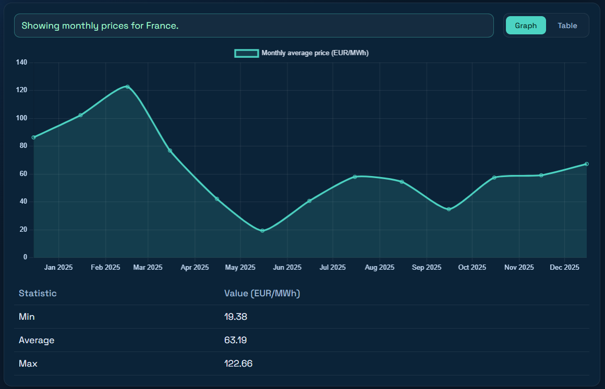
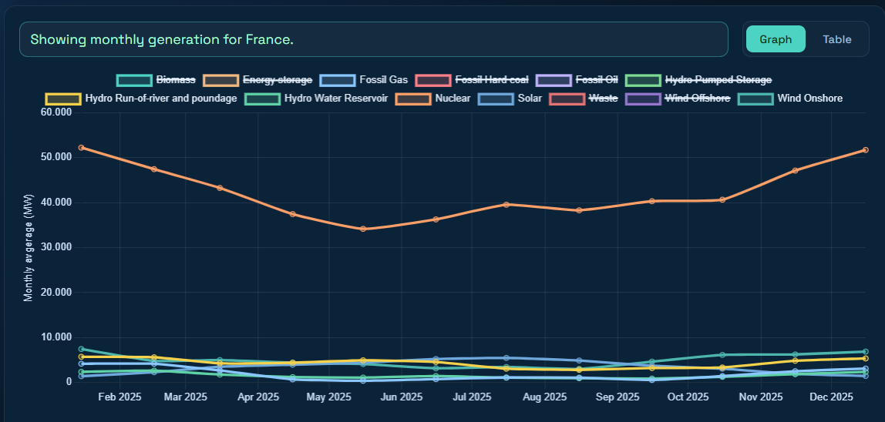
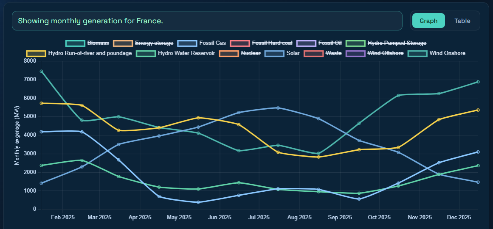

# Interaktivna Flask spletna aplikacija 

Funkcionalnost aplikacije je grafični ali tabelarični prikaz podatkov o cenah in proizvodnji energije po tipih proizvodnje za izbrano časovno obdobje in lokacijo. Podatke pridobi prek portala ENTSO-E s pomočjo API-ja. Potreben je ENTSO-E API key!

## Struktura projekta

```
├── main.py              # Flask aplikcija z endpointi
├── controller.py        # API klici
├── utils.py             # Pomožne funckije
├── config.py            # Konfiguracija
├── constants.py         # ENTSO-E mappingi
├── templates/
│   └── index.html       # HTML datoteka
├── static/
│   ├── app.js           # JavaScript datoteka
│   └── styles.css       # CSS Oblikovanje
├── img                  # slike
├── Dockerfile           # Docker konfiguracija
├── compose.yml          # Docker kompozicija
└── requirements.txt     # Potrebna orodja
```

## Programske zahteve
- **Backend**: Python 3.12, Flask
- **Frontend**: HTML, CSS, JavaScript
- **Grafična vizualizacija**: Chart.js
- **Ostalo**: Docker

## Povezave med posameznimi tipi proizvodnje in ceno električne energije
Za ugotovitev obstoja potencialnih povezav med posameznimi tipi proizvodnje in ceno električne energije si lahko pomagamo z aplikacijo. Za primer vzemimo ceno povprečne mesečne električne energije v Franciji v zadnjem letu (17.12.2024 - 17.12.2025). Cena je prikazana na spodnjem grafu:



Podobno si lahko pogledamo podatke o proizvodnji po posameznih tipih v zadnjem letu. Slednje prikazuje graf na spodnji sliki (primer Francije).



Na primeru Francije je z grafa razvidno, da primarni vir proizvodnje električne energije izhaja iz nuklearne energije. Videti je, da graf proizvodnje električne energije iz nuklearne relativno malo niha, iz česar lahko sklepamo, da ta tip proizvodnje ne vpliva ključno na ceno električne energije. Če se osredotočimo na ostale vire proizvodnje električne energije, lahko morda najdemo smiselne povezave. Spodnji graf prikazuje proizvodnjo električne energije po ostalih tipih proizvodnje, ki poleg nuklearne predstavljajo večinski delež.


Graf sončne energije (modra črta) se skozi leto precej spreminja. V toplejši polovici leta se seveda proizvodnja sončne energije poveča, saj je več sončnih dni, kot v zimskem času. Ker gre za obnovljiv vir energije in so proizvodni stroški relativno nizki, ta tip proizvodnje električne energije znižuje ceno le te. To lahko opazimo tudi na prvem grafu, kjer se cena električne energije na prehodu iz zimskega v poletno obdobje znižuje. Gre torej za negativno korelacijo med ceno električne energije in proizvodnjo iz sončne energije.

Poglejmo si sedaj, kako se na grafu giblje proizvodnja električne energije iz fosilnih goriv. Gibanje prikazuje svetlo modra črta. Vidimo, da je v primerjavi s sončno energijo trajektorija proizvodnje iz fosilnih goriv ravno obratnosorazmerna. Prav tako je trend gibanja v primerjavi s ceno električne energije precej podoben. Ko je torej cena električne energije najvišja, je proizvodnja le te iz fosilnih goriv prav tako najvišja. Lahko zaključimo, da gre za pozitivno korelacijo med tema dvema dejavnikoma.

## Postavitev aplikacije v produkcijo
Za deployment lahko uporabimo naslednja orodja:
- **Za delo v container-jih**: Docker - omogoča, da Flask aplikacijo poženemo znotraj posameznega container-ja, ki je osnovan na Linux sistemu
- **WSGI server**: Gunicorn - standardni produkcijski WSGI server za Python aplikacije, ki deluje znotraj Docker container-ja
- **Reverse proxy**: ngnix ali IIS za Windows - skrbi za uporabniške requeste in služi kot public endpoint
- **Caching**: Redis

Postopek deploymenta bi potekal na sledeč način:
1) V Docker datoteki je aplikacija zagnana lokalno za potrebe razvoja. To bi spremenili na način, da bi uporabili Gunicorn, ki bi poskrbel za produkcijski način delovanja.

2) povežemo se na Windows virtualni strežnik in v Windows subsystem for Linux (WSL-ju) z Githuba prenesmo Flask aplikacijo. Znotrja WSL-ja zgradimo container, ki bo pognal aplikacijo. To naredimo s pomočjo komand, ki so zapisane v datoteki `DOCKER_README.md` ali po potrebi ta proces avtomatiziramo. Torej ob posodobitvi main brancha bi se omenjen postopek s pomočjo CI/CD orodij izvedel avtomatsko. Glede na to, da uporabljamo Docker, bi lahko ngnix vključili v Docker `compose.yml` datotetko in spisali nginx konfiguracijo v `ngnix.conf`.
<br>
<br>
V primeru, da ne bi uporabili Docker-ja in WSL-ja in bi želeli aplikacijo postaviti direktno na Windows strežnik, bi uporabili drug WSGI server, saj Gunicorn ne deluje na Windows operacijskem sistemu. Tako bi ngnix uporabili na drugačen način ali alternativo, kot je Microsoft Internet Infromation Services (IIS).

3) V zadnjem koraku poskrbimo za optimizacijo. To lahko storimo s pomočjo data cachinga z uporabo orodja Redis. S tem poskrbimo, da aplikacija deluje hitro pri 50+ uporabnikih, saj ne želimo, da vsak uporabniški request sproži API klic. Na ta način bi se lahko izognili API klicom in podatke pošiljali iz baze. Ker uporabljamo Docker bi lahko Redis zagnali v dodatnem Container-ju Če pa bi aplikacijo želelo uporabljati bistveno večje število uporabnikov, bi uporabili horizontalno skaliranje.